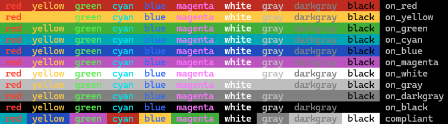

# colored cout

  
<sup><i>Theme: Ottosson, font: Liberation Mono.</i></sup>

"colored cout" is a few ANSI color macros and a simple overloading of `operator<<`
that allow you to print in console using 10 basic colors:
- red
- green
- blue
- cyan
- magenta
- yellow
- white
- gray
- darkgray
- black

Usage:
```cpp
std::cout << clr::red      << clr::on_cyan     << " red "
          << clr::yellow   << clr::on_blue     << " yellow "
          << clr::green    << clr::on_magenta  << " green "
          << clr::cyan     << clr::on_red      << " cyan "
          << clr::blue     << clr::on_yellow   << " blue "
          << clr::magenta  << clr::on_green    << " magenta "
          << clr::white    << clr::on_black    << " white "
          << clr::gray     << clr::on_darkgray << " gray "
          << clr::darkgray << clr::on_gray     << " darkgray "
          << clr::black    << clr::on_white    << " black "
          << clr::reset                        << " compliant\n";
std::cout << CLR_RED      CLR_ON_CYAN     " red "
          << CLR_YELLOW   CLR_ON_BLUE     " yellow "
          << CLR_GREEN    CLR_ON_MAGENTA  " green "
          << CLR_CYAN     CLR_ON_RED      " cyan "
          << CLR_BLUE     CLR_ON_YELLOW   " blue "
          << CLR_MAGENTA  CLR_ON_GREEN    " magenta "
          << CLR_WHITE    CLR_ON_BLACK    " white "
          << CLR_GRAY     CLR_ON_DARKGRAY " gray "
          << CLR_DARKGRAY CLR_ON_GRAY     " darkgray "
          << CLR_BLACK    CLR_ON_WHITE    " black "
          << CLR_RESET                    " compliant\n";
```

Tested on `MSVC 14.0 + Windows 10`, `GCC 5.2 + Ubuntu 15.10`, `MSVC 19.39 + Windows 11`,
`GCC 12.3 + Ubuntu 22.04 in WSL2`

To enable ANSI/VT100 Escape Sequences on Windows 10:
```cpp
DWORD mode = ENABLE_PROCESSED_OUTPUT;
// This flag is supported by Windows versions equal to or greater than 10.0.14393 (1607)
// Windows 10 version 20H2 (and later) sets this flag by default
mode |= ENABLE_VIRTUAL_TERMINAL_PROCESSING;
SetConsoleMode(GetStdHandle(STD_OUTPUT_HANDLE), mode);
```
